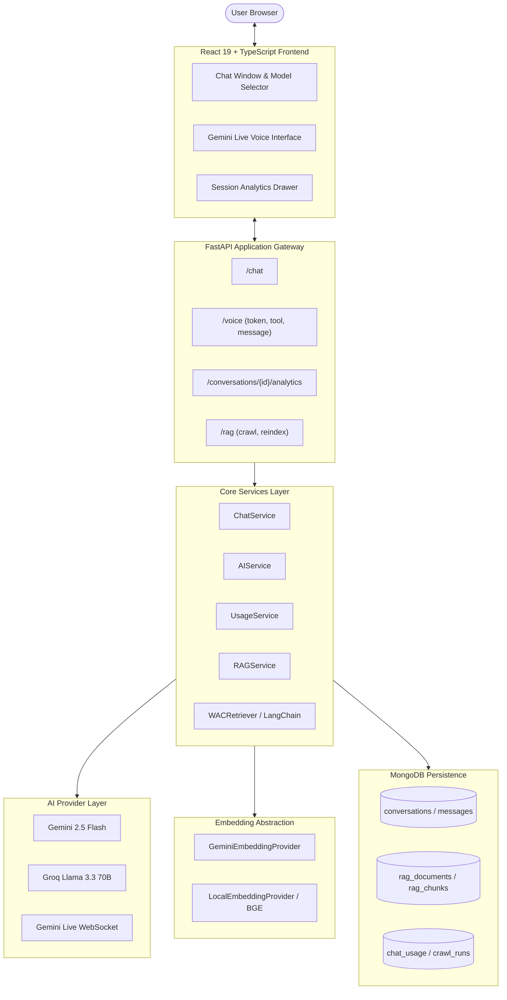
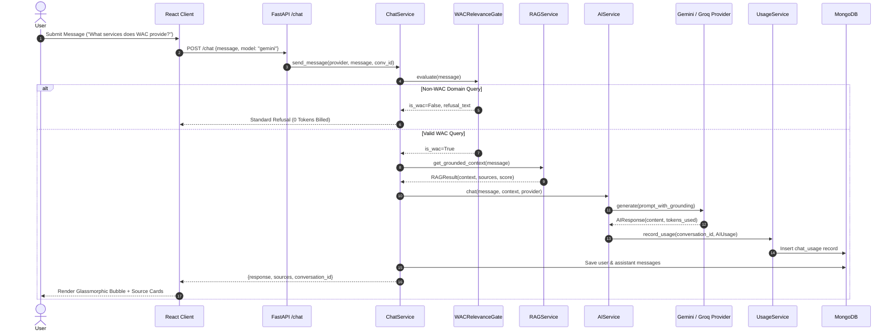
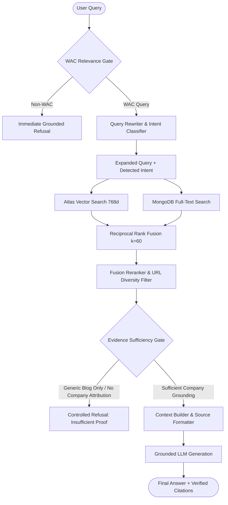
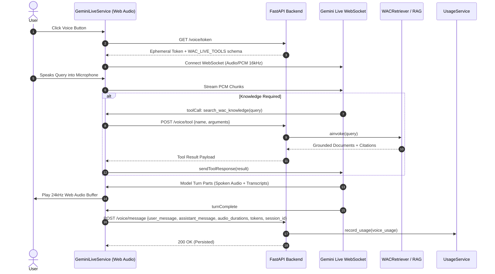
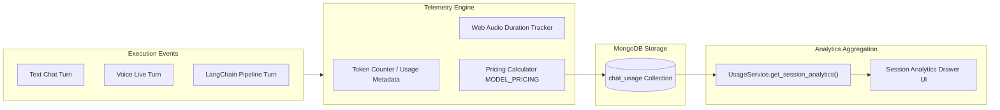
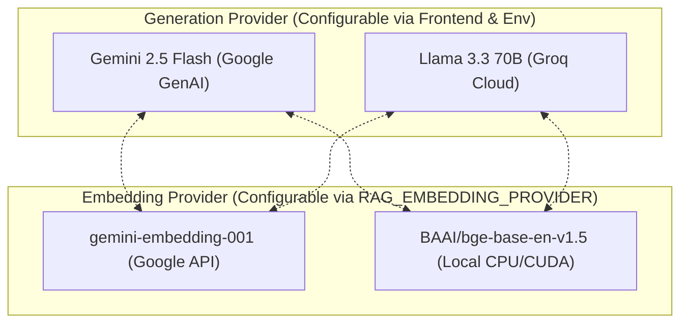

# WAC AI Assistant — Comprehensive System Architecture

## 1. High-Level Architecture Overview

The WAC AI Assistant is structured into modular layers spanning frontend presentation, API routing, intelligence services, retrieval pipelines, and persistence.

---

## 2. End-to-End Text Chat Flow

---

## 3. Detailed RAG Retrieval Flow

---

## 4. Gemini Live Multimodal Voice Flow

---

## 5. Analytics & Cost Accounting Flow

---

## 6. Provider Decoupling Matrix

The architecture strictly isolates **Text Generation** from **Embedding Generation**:

